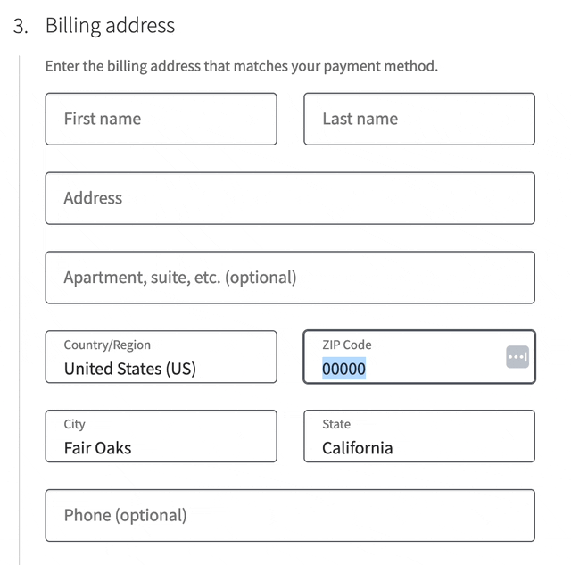
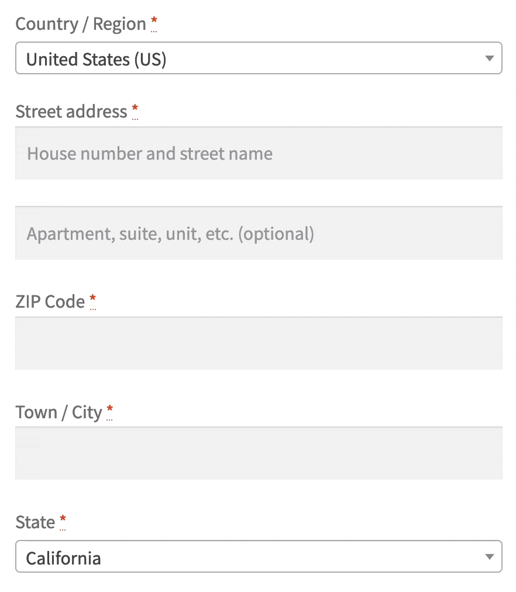

   

# Postcode Address Autofill for WooCommerce

Performs a zipcode lookup to autofill the city and state fields. First moves the postcode field above the city and state fields.

Works with WooCommerce Blocks checkout. Postcode data available for the United States (US), Ireland (IE) and Japan (JP). 

## TODO:

* Send `available_countries` to the frontend to avoid unnecessary lookups
* Shipping addresses (done for shortcode checkout)
* My Account
* JS/TS sourcemap
* Add city suggestions via select2 where postcode is not precise enough
* ~~Serialize data and store in database~~ v1.2.0