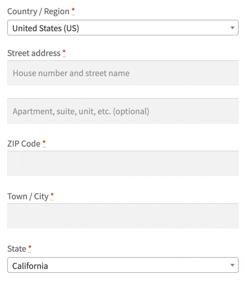

  

# Postcode Address Autofill for WooCommerce

Performs a zipcode lookup to autofill the city and state fields. First moves the postcode field above the city and state fields.

Postcode data available for the United States (US), Ireland (IE) and Japan (JP).

### TODO

* Use Select2 on City input to suggest known cities for postcode

### More Information

See [github.com/BrianHenryIE/WordPress-Plugin-Boilerplate](https://github.com/BrianHenryIE/WordPress-Plugin-Boilerplate) for initial setup rationale. 

# Acknowledgements